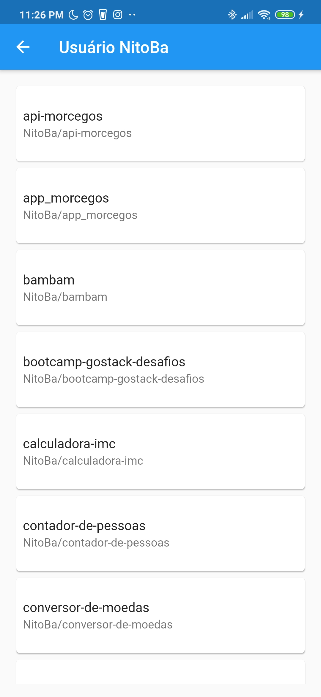

# Search Github with Modular

Studies in flutter modular, creating application in Flutter that search users on Github and list your repositories

---

# ↓Technologies used

- Flutter
- Mobx
- Flutter Modular
- Resquest Api

---

# ↓ Quick Start

- clone this project or fork

```jsx
git clone https://github.com/NitoBa/githubsearch-modular.git
```

- how to install app

```dart
type command "flutter run" or press "F5" for debug mode in vscode
```

---

# ↓Search Users

- Type your github username in search field

invalid username return user not found and

username correct return the user of github and able the user to navigate to the next route


# ↓Search Repositories

- Return all repositories of user


